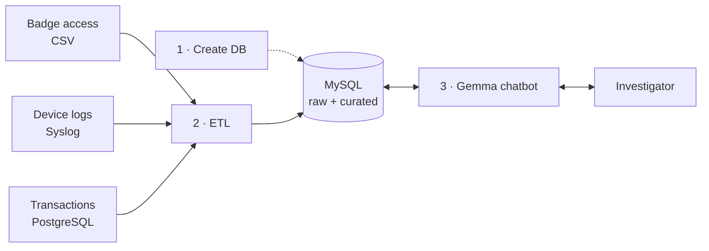

# Case Closed: The Broken Alibi


A data pipeline and investigator chatbot for the **Case Closed 2026 Data Engineering track**.

A senior executive at Blackwood Technologies was found dead on August 15, 2026. The evidence is
spread across three systems that don't talk to each other. This project turns it into one
**defensible, queryable timeline**. Investigators ask questions in plain English, and every answer
can be traced back to an unaltered source record.

> **Core question:** Reconstruct the sequence of events between 10:00 PM and 12:00 AM on
> August 14, 2026, and flag any contradictions with the three alibis provided.

---

## How it works



1. **Create the database.** This sets up `raw`, `curated` and `audit` schemas, triggers that make
   raw data write-once, and least-privilege database users.
2. **ETL.** Each source is parsed, and every record is stored *exactly as written* along with its
   SHA-256 fingerprint. SQL then builds one unified timeline in `curated.employee_activity_timeline`.
3. **Chatbot.** Gemma turns the question into SQL, and a guard checks it. The query runs read-only.
   Each returned record is verified against its original source line. Gemma then explains the
   result and flags alibi contradictions.

## What the investigator sees

- A plain-English answer that quotes exact timestamps and employee IDs
- A **✓ VERIFIED** stamp ("14/14 records match source"), or **✗ TAMPERING DETECTED**
- The evidence records and the exact SQL that was run
- An audit log entry number for every question
- A live **model status** panel: model name, parameter count, quantization, memory use and GPU

## Findings from the data

| Suspect | Alibi | Result |
|---|---|---|
| EMP-0031 | "In the server room… left before 11 PM." | **Contradicted:** left the server room at 23:07:44; their car exited at 22:59:31 |
| EMP-0047 | "On the 3rd floor… left around midnight." | **Contradicted:** left the 3rd-floor exec area at 23:22:56; laptop active until 23:58:02 |
| EMP-0092 | "I was in and out." | **Consistent:** out 22:14:58, back 23:41:29, final exit 00:11:33 |
| EMP-0011 | *No alibi* | Fourth person on site: USB inserted 23:44:17, stairwell B 23:52:07 |

All times are UTC.

---

## Quick start

### Prerequisites

- Python 3.10+
- MySQL 8+ (tested on 9.2)
- [Ollama](https://ollama.com/download), with about 4 GB of free GPU memory (or a Google AI Studio key, see [Model](#model))

### 1. Install

```bash
git clone https://github.com/youssefguessmi/case-closed.git
cd case-closed
pip install -r requirements.txt
ollama pull gemma3:4b
```

### 2. Configure

```bash
cp .env.example .env
```

Set `MYSQL_ADMIN_PASSWORD` to your MySQL root password, and choose passwords for the read-only and
audit users. `.env` is gitignored, so never commit it.

### 3. Build the database

Pick one. Both produce identical tables.

```bash
# A) Python loader, connects to MySQL directly (add --reset to rebuild from scratch)
python -m pipeline.load

# B) Plain SQL, no Python needed on the database machine
python -m pipeline.export_sql --users      # writes sql/users.sql from your .env
mysql -u root -p < sql/blackwood.sql       # tables + data (WARNING: drops raw/curated/audit)
mysql -u root -p < sql/users.sql           # chatbot users
```

### 4. Run the chatbot

```bash
streamlit run app.py          # web UI at http://localhost:8501
python main.py               # or in the terminal
```

Suggested questions to start with:

- *Reconstruct the timeline for EMP-0047, EMP-0031 and EMP-0092 between 10 PM and midnight*
- *Does EMP-0031's alibi hold up?*
- *Was anyone in the server room after 11 PM?*
- *Who plugged in a USB device that night?*

---

## Configuration

All settings live in `.env` (see [`.env.example`](.env.example)).

| Variable | Default | Purpose |
|---|---|---|
| `MYSQL_HOST` / `MYSQL_PORT` | `127.0.0.1` / `3306` | MySQL server |
| `MYSQL_ADMIN_USER` / `MYSQL_ADMIN_PASSWORD` | `root` / - | Used only by the loader to create schemas and users |
| `MYSQL_RO_USER` / `MYSQL_RO_PASSWORD` | `investigator_ro` | SELECT-only account the chatbot queries with |
| `MYSQL_AUDIT_USER` / `MYSQL_AUDIT_PASSWORD` | `audit_writer` | May only append to the audit log |
| `LLM_BACKEND` | `ollama` | `ollama` (local) or `google` (Google AI Studio) |
| `OLLAMA_MODEL` | `gemma3:4b` | Any Ollama model tag |
| `GOOGLE_MODEL` / `GOOGLE_API_KEY` | `gemma-3-27b-it` | For the hosted backend |
| `MAX_ROWS` | `500` | Row cap on every query |
| `QUERY_TIMEOUT_MS` | `5000` | MySQL statement timeout |
| `MAX_SQL_RETRIES` | `2` | Times Gemma may fix a rejected or failing query |

## Model

| | |
|---|---|
| Model | `gemma3:4b` (Gemma 3, via Ollama) |
| Parameters | 4.3 B |
| Quantization | Q4_K_M (4-bit) |
| Download / on disk | 3.3 GB |
| Memory when loaded | ~3.0 GB at an 8,192-token context |
| Tested on | RTX 4060 Laptop (8 GB) |

**Slow answers on a laptop with two GPUs?** Ollama may pick the integrated GPU through Vulkan.
Turn off Vulkan in Ollama's settings (or set `OLLAMA_VULKAN=0`) and restart Ollama. The app's model
panel warns you when this happens.

**Want better answers?** The 4B model sometimes misreads questions; the evidence and SQL are always
shown so a person can check. To use the larger hosted Gemma, run `pip install google-genai`, then
set `LLM_BACKEND=google` and `GOOGLE_API_KEY` in `.env`.

---

## Chain of custody

| Control | What it proves |
|---|---|
| SHA-256 per record at ingest | Each record's fingerprint is carried into the curated table as `raw_event_hash` |
| Write-once raw tables | MySQL triggers block `UPDATE` and `DELETE`, even for root |
| Source file manifest | Each data file's hash at ingest, re-checkable against the file on disk |
| Per-answer verification | Every returned event is re-hashed and re-parsed from its raw line; person and time must still match |
| Hash-chained audit log | Every question, its SQL and a hash of the result; editing a past entry breaks the chain |

We tested it by moving EMP-0031's server-room exit from 23:07:44 to 22:50:00 in the curated table.
The next query reported **1 of 14 events failed verification**.

## Query safety

Generated SQL is never trusted. [`serving/sql_guard.py`](serving/sql_guard.py) parses every query
with sqlglot and allows only:

- one `SELECT` statement (CTEs and `UNION` are fine)
- the three `curated` tables
- no `SLEEP`, `LOAD_FILE`, `INTO OUTFILE`, DML or DDL
- at most `MAX_ROWS` rows

It then runs under a SELECT-only MySQL user, in a read-only transaction with a timeout.

---

## Repository layout

```
case-closed/
├── app.py                    # Streamlit chatbot (serving layer)
├── chatbot_cli.py            # Terminal chatbot
├── config.py                 # Settings from .env
├── serving/
│   ├── agent.py              # question → SQL → run → verify → log → explain
│   ├── llm.py                # Gemma client (Ollama or Google) + model/GPU info
│   ├── prompts.py            # Prompts and example queries for Gemma
│   ├── sql_guard.py          # Validates generated SQL
│   ├── custody.py            # Per-record and per-file verification
│   ├── audit.py              # Hash-chained audit log
│   ├── db.py                 # Read-only and audit connections
│   └── saved_queries.py      # Hand-written reference queries
├── pipeline/
│   ├── parsers.py            # CSV, syslog and Postgres-dump parsers
│   ├── load.py               # Builds raw/curated/audit in MySQL
│   └── export_sql.py         # Generates sql/blackwood.sql
├── sql/blackwood.sql         # Standalone MySQL build script (generated)
├── main.py                   # Same as chatbot_cli.py: python main.py starts the terminal chat
├── tests/test_offline.py     # Tests that need no DB or LLM
├── Case Closed - The Broken Alibi.pptx   # Presentation
├── badge_access.csv          # Source data
├── device_logs.log
└── building_transactions.sql
```

## Tests

```bash
python -m pytest tests
```

The tests cover the parsers, hashing, the SQL guard (14 unsafe queries rejected) and the SQL
exporter. They need no database or model.

## Known limitations

- Device events show a computer was used, not where its owner was.
- Source clocks are assumed to be synchronized UTC. Clock drift is not corrected.
- A database admin with `DROP` rights can still destroy data. The controls make that *detectable*, not impossible.
- One MySQL server; not yet sized for Blackwood's ~50 GB/day.
- The 4B model can misread a question, so always check the evidence panel.

---

Built for **Case Closed 2026** (Data Engineering track), hosted by Google Developer Group
Sheridan College, TechBiz and the Sheridan Finance Club.
